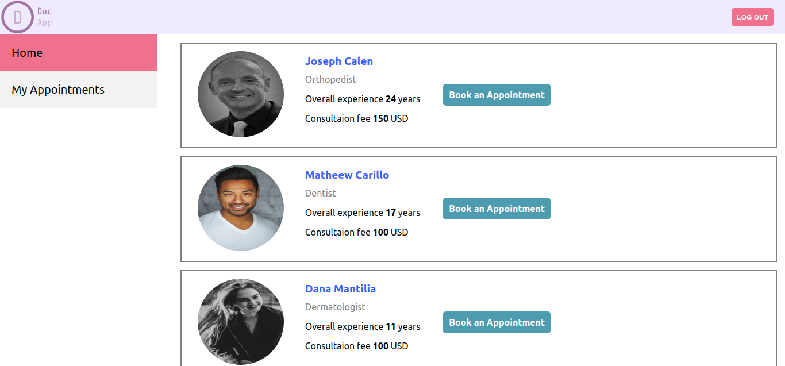
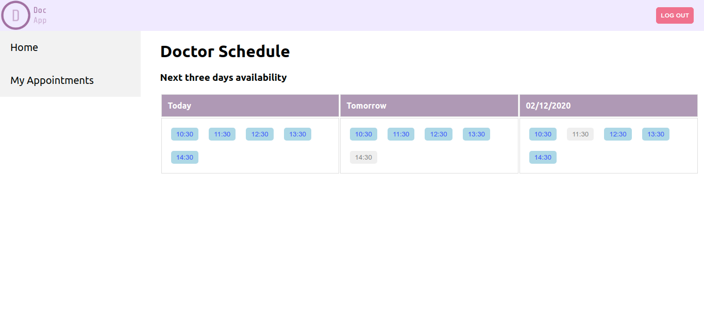

# Doc App

> A Doctor appointment application built on React and Redux libraries and Rails as a backend.

## Table of Contents

- [Features](#features)
- [Built With](#built-with)
- [Live Demo](#live-demo)
- [Getting Started](#getting-started)
  - [Installation](#installation)
  - [Usage](#usage)
- [Roadmap](#roadmap)
- [Author](#author)

## Features

- Allows Doctor & patient to register, login and logout.
- Patient can view the available time slots of each doctor.
- Patient can also view the booked time slots of each doctor.
- Patient can book the required appointment of each doctor.
- Patient can see their booked appointments in appointments page.
- Doctor can create their own schedules.
- Patient can view the profile of the doctor.
- Doctor can see their appointments in dashboard page.
- Deployed to Heroku

## Screenshot





## Built With

- React
- Redux
- React-Create-App
- npm
- CSS
- ES6
- Heroku
- Rails API by me [Link](https://github.com/rna/docapp-api)

## Live Demo

[Live Demo Link](https://rna-docapp.herokuapp.com/)

## Getting Started

To get a local copy up and running, follow these simple example steps.

### Prerequisites

- NodeJs

<!-- ### Setup -->

### Installation

Clone the repo with:

```sh
git clone https://github.com/rna/docapp
```

### Usage

1. Run `npm install` to install all dependencies

2. Run `npm start` to start the local server

### Testing

1. Run `npm test a` to test

## Roadmap

- View the doctor details in the patient appointments dashboard
- Add calendar selection for viewing the available slots of a required day
- View the patient details in the doctor dashboard against each appointment

<!-- ### Deployment -->

### Author

👤 **Ramesh Naidu Allu**

- Github: [@rna](https://github.com/rna)
- Twitter: [@rnadev](https://twitter.com/rnadev)
- Linkedin: [Linkedin](https://linkedin.com/in/ramesh-naidu)

## 🤝 Contributing

Contributions, issues and feature requests are welcome!

Feel free to check the [issues page](issues/).

## Show your support

Give a ⭐️ if you like this project!

## Acknowledgments

- [create-react-app-buildpack](https://github.com/mars/create-react-app-buildpack)

## 📝 License

This project is [MIT](lic.url) licensed.
